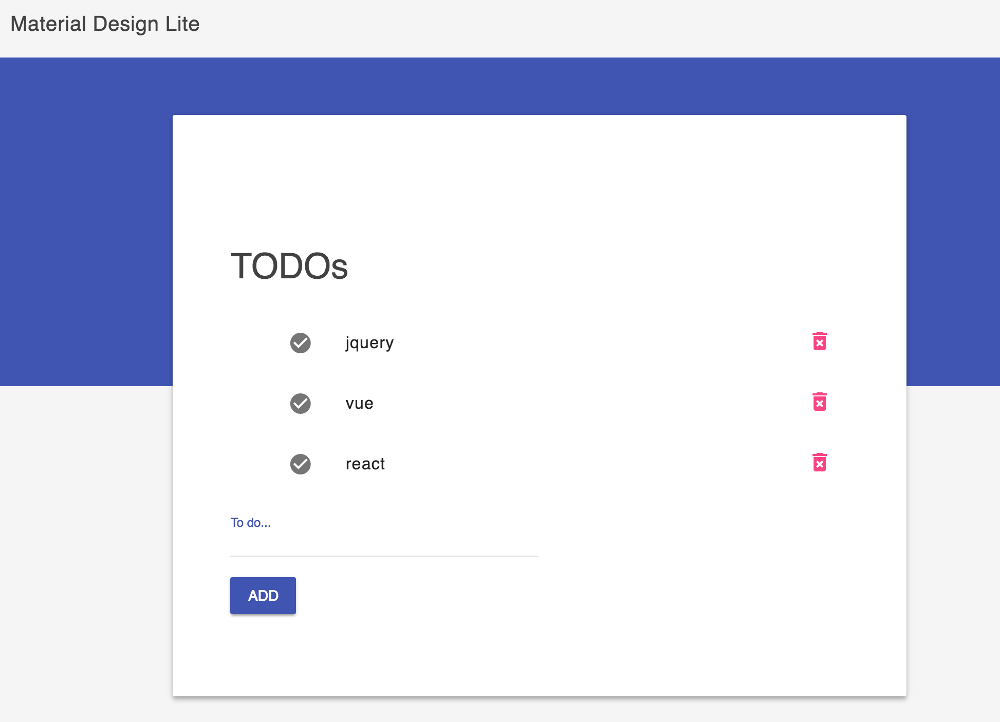

# firebase-jquery-vue-react-todo

Three identical ToDo apps using Firebase: jQuery, Vue, React.

Commands:

    #create new project in Firebase console

    # initialize project files:
    firebase init
    # for static site you can remove all firebase <script>'s

    # test locally:
    firebase serve

    # deploy:
    firebase deploy

    # Disable hosting:
    firebase hosting:disable
